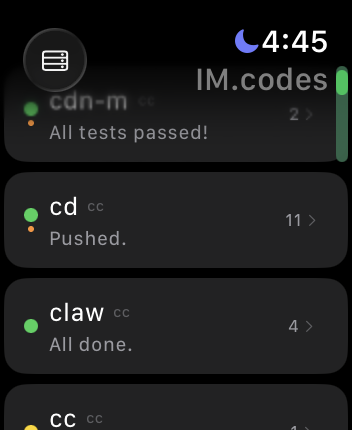
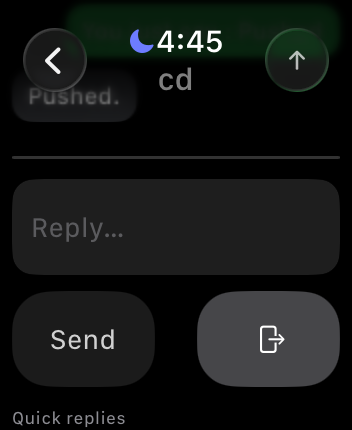
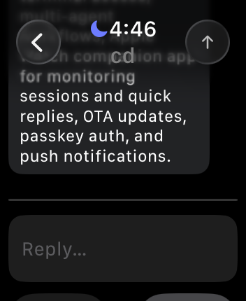

# [IM.codes](https://im.codes)

[English](../README.md) | [简体中文](README.zh-CN.md) | [繁體中文](README.zh-TW.md) | [Español](README.es.md) | [Русский](README.ru.md) | [日本語](README.ja.md) | [한국어](README.ko.md)

**Слой мессенджера для агентов.**

IM.codes — специализированный мессенджер для AI coding agents. Он позволяет держать долгие agent‑сессии под рукой с телефона или из веба: терминал, файлы, Git, просмотр localhost, уведомления и multi‑agent workflows. Поддерживаются Claude Code, Codex, Gemini CLI, OpenClaw и Qwen.

> Это перевод. **Каноническая версия — английский README (`../README.md`).** Если есть расхождения, ориентируйтесь на английский вариант.

Claude Code и Codex теперь поддерживают два способа интеграции: CLI и SDK.

## Скриншоты

### Десктоп

<p>
<a href="https://raw.githubusercontent.com/im4codes/imcodes/master/landing/imcodes-sidebar.png"></a>
<a href="https://raw.githubusercontent.com/im4codes/imcodes/master/landing/imcodes0.png"></a>
<a href="https://raw.githubusercontent.com/im4codes/imcodes/master/landing/imcodes1.png"></a>
<a href="https://raw.githubusercontent.com/im4codes/imcodes/master/landing/imcodes2.png"></a>
</p>

### iPad / Планшет

<p>
<a href="https://raw.githubusercontent.com/im4codes/imcodes/master/landing/imcodes-ipad2.png"></a>
<a href="https://raw.githubusercontent.com/im4codes/imcodes/master/landing/imcodes-ipad3.png"></a>
</p>

### Мобильный

<p>
<a href="https://raw.githubusercontent.com/im4codes/imcodes/master/landing/imcodes-m6.png"></a>
<a href="https://raw.githubusercontent.com/im4codes/imcodes/master/landing/imcodes-m7.png"></a>
<a href="https://raw.githubusercontent.com/im4codes/imcodes/master/landing/imcodes-m8.png"></a>
<a href="https://raw.githubusercontent.com/im4codes/imcodes/master/landing/imcodes-m5.png"></a>
<a href="https://raw.githubusercontent.com/im4codes/imcodes/master/landing/imcodes-m1.png"></a>
<a href="https://raw.githubusercontent.com/im4codes/imcodes/master/landing/imcodes-m2.png"></a>
<a href="https://raw.githubusercontent.com/im4codes/imcodes/master/landing/imcodes-m3.png"></a>
<a href="https://raw.githubusercontent.com/im4codes/imcodes/master/landing/imcodes-m4.png"></a>
<a href="https://raw.githubusercontent.com/im4codes/imcodes/master/landing/imcodes-m0.png"></a>
</p>

### Apple Watch

<p>
<a href="https://raw.githubusercontent.com/im4codes/imcodes/master/landing/imcodes-watch1.png"></a>
<a href="https://raw.githubusercontent.com/im4codes/imcodes/master/landing/imcodes-watch0.png"></a>
<a href="https://raw.githubusercontent.com/im4codes/imcodes/master/landing/imcodes-watch2.png"></a>
</p>

Поддержка часов включает быстрый просмотр сессий, счётчики непрочитанных сообщений, push‑уведомления и быстрые ответы с запястья.

## Загрузка

<a href="https://apps.apple.com/us/app/im-codes/id6761014424"></a>

Поддерживаются iPhone, iPad и Apple Watch. Также доступно как [web app](https://app.im.codes) и через `npm install -g imcodes` (CLI daemon).

## Зачем

Когда вы отходите от рабочего места, большинство workflows с coding agents ломается. Агент всё ещё работает в терминале, но продолжение требует SSH, `tmux attach`, удалённого рабочего стола или ожидания возвращения к ноутбуку.

[IM.codes](https://im.codes) удерживает эти сессии доступными с телефона или из веба: открыть терминал, проверить файлы и Git, посмотреть localhost с другого устройства, получить уведомление о завершении работы и координировать несколько агентов на собственной инфраструктуре.

Это не ещё один AI IDE и не просто удалённый терминал. Это слой обмена сообщениями и управления вокруг терминальных coding agents.

## Возможности

### Удалённый терминал
Полный доступ к терминалу agent‑сессий из любого браузера без SSH, VPN и проброса портов.

### Браузер файлов и Git changes
Просмотр дерева проекта, загрузка и скачивание файлов, diff‑просмотр и обзор изменений.

### Локальный web preview
Без деплоя можно открыть локальный dev‑сервер на телефоне, планшете или в удалённом браузере.

### Мобильные устройства, часы и уведомления
Есть биометрическая аутентификация, push‑уведомления, ввод для shell‑сессий и быстрые ответы на Apple Watch.

### Кросс-модельный аудит и P2P обсуждения
Выходу одной модели нельзя доверять слепо. P2P обсуждения позволяют нескольким агентам — от разных провайдеров и с разными стилями мышления — совместно анализировать одну кодовую базу ещё до написания кода. Каждый раунд следует настраиваемому многоэтапному пайплайну, где каждый агент читает все предыдущие вклады. Разные модели находят разные типы проблем. Такая перекрёстная проверка выявляет большинство проблем до реализации, резко сокращая переделки.

Встроенные режимы: `audit` (структурированный пайплайн audit → review → plan), `review`, `discuss` и `brainstorm` — или определите собственную последовательность фаз. Работает с Claude Code, Codex, Gemini CLI и Qwen.

### Потоковые transport‑агенты
OpenClaw и Qwen работают через структурированный transport‑stream вместо terminal scraping.

### Связь агент ↔ агент
`imcodes send` позволяет одному агенту напрямую просить другого проверить код, запустить тесты или продолжить задачу.

```bash
imcodes send "Plan" "review the changes in src/api.ts"
imcodes send "Cx" "run tests" --reply
imcodes send --all "migration complete, check your end"
```

```python
# monitor.py — watch a log file, trigger agent when errors appear
import subprocess, time

while True:
    with open("/var/log/app.log") as f:
        for line in f:
            if "ERROR" in line:
                subprocess.run([
                    "imcodes", "send", "Claude",
                    f"Fix this error and write the patch to /tmp/fix.patch:\n{line}"
                ])
    time.sleep(30)
```

```bash
# Webhook → agent: GitHub webhook handler triggers code review
curl -X POST https://your-server/webhook -d '{"pr": 42}' \
  && imcodes send "Gemini" "review PR #42, write summary to /tmp/review.md"

# CI → agent: post-build trigger
imcodes send "Claude" "tests failed on main, check CI log at /tmp/ci.log and fix" --reply
```

### Умный picker `@`
`@` ищет файлы проекта, `@@` выбирает агентов для P2P dispatch.

### Управление несколькими серверами и сессиями
Можно подключить несколько dev‑машин к одной панели.

### Боковая панель в стиле Discord
Есть панель серверов, древовидный список сессий, unread badges и закрепляемые окна.

### Закрепляемые панели
Файловый браузер, страница репозитория, чат sub‑session и терминал можно закрепить в боковой панели.

### Дашборд репозитория
В приложении можно просматривать issues, PR, branches, commits и CI/CD runs.

### Планировщик задач (Cron)
Поддерживаются cron‑задачи для запуска команд и multi‑agent дискуссий.

### Синхронизация между устройствами
Порядок вкладок и закреплённые панели синхронизируются через серверные preferences.

### Интернационализация
Интерфейс поддерживает 7 языков.

### OTA‑обновления
Daemon может обновляться через npm, в том числе по команде из веб‑интерфейса.

## Чем IM.codes не является

- Это не ещё один AI IDE
- Это не просто чат‑обёртка
- Это не просто клиент удалённого терминала
- Это не замена Claude Code, Codex, Gemini CLI, OpenClaw или Qwen
- Это слой управления и обмена сообщениями вокруг них

## Архитектура

```
You (browser / mobile)
        ↓ WebSocket
Server (self-hosted)
        ↓ WebSocket
Daemon (your machine)
        ↓ tmux / transport
AI Agents (Claude Code / Codex / Gemini CLI / OpenClaw)
        ↔ imcodes send (agent-to-agent)
```

Daemon работает на вашей dev‑машине и управляет сессиями через tmux или transport‑протоколы. Сервер проксирует соединения между вашими устройствами и daemon. Всё остаётся на вашей инфраструктуре.

## Установка

```bash
npm install -g imcodes
```

## Быстрый старт

> **Self-hosting настоятельно рекомендуется.** Общий инстанс `app.im.codes` предназначен только для тестирования.

```bash
imcodes bind https://app.im.codes/bind/<api-key>
```

Эта команда привязывает вашу машину, запускает daemon, регистрирует его как системный сервис и добавляет машину в веб / мобильную панель.

### Подключение OpenClaw

Если OpenClaw запущен локально, подключите IM.codes к OpenClaw gateway на машине с daemon:

```bash
imcodes connect openclaw
```

Команда:

- подключается по умолчанию к `ws://127.0.0.1:18789`
- автоматически использует token из `~/.openclaw/openclaw.json`
- синхронизирует основные и дочерние сессии OpenClaw в IM.codes
- сохраняет конфигурацию в `~/.imcodes/openclaw.json`
- перезапускает daemon для автоматического восстановления transport‑сессий

```bash
imcodes connect openclaw --url ws://127.0.0.1:18789
OPENCLAW_GATEWAY_TOKEN=... imcodes connect openclaw
imcodes connect openclaw --url wss://gateway.example.com
```

Примечания:

- для удалённых `ws://` без TLS нужен `--insecure`
- `imcodes disconnect openclaw` удаляет сохранённую конфигурацию и разрывает соединение
- этот сценарий пока тестировался только на macOS

## Self-host

### Настройка одной командой

```bash
npm install -g imcodes
mkdir imcodes && cd imcodes
imcodes setup --domain imc.example.com
```

### Ручная настройка

```bash
git clone https://github.com/im4codes/imcodes.git && cd imcodes
./gen-env.sh imc.example.com        # generates .env with random secrets, prints admin password
docker compose up -d
```

## Windows (экспериментально)

```cmd
npm install -g imcodes
imcodes bind https://app.im.codes/bind/<api-key>
```

```cmd
imcodes upgrade
```

```cmd
imcodes repair-watchdog
```

```cmd
npm prefix -g
```

```cmd
setx PATH "<npm-prefix-path>;%PATH%"
```

```
%USERPROFILE%\.imcodes\watchdog.log
```

## Требования

- macOS или Linux
- Windows (экспериментально) через ConPTY
- Node.js >= 20
- tmux на Linux/macOS
- как минимум один AI coding agent: Claude Code, Codex, Gemini CLI, OpenClaw или Qwen

## Дисклеймер

IM.codes — независимый open-source проект и не аффилирован с Anthropic, OpenAI, Google, Alibaba, OpenClaw или другими упомянутыми компаниями.

## Лицензия

[MIT](../LICENSE)

© 2026 [IM.codes](https://im.codes)
