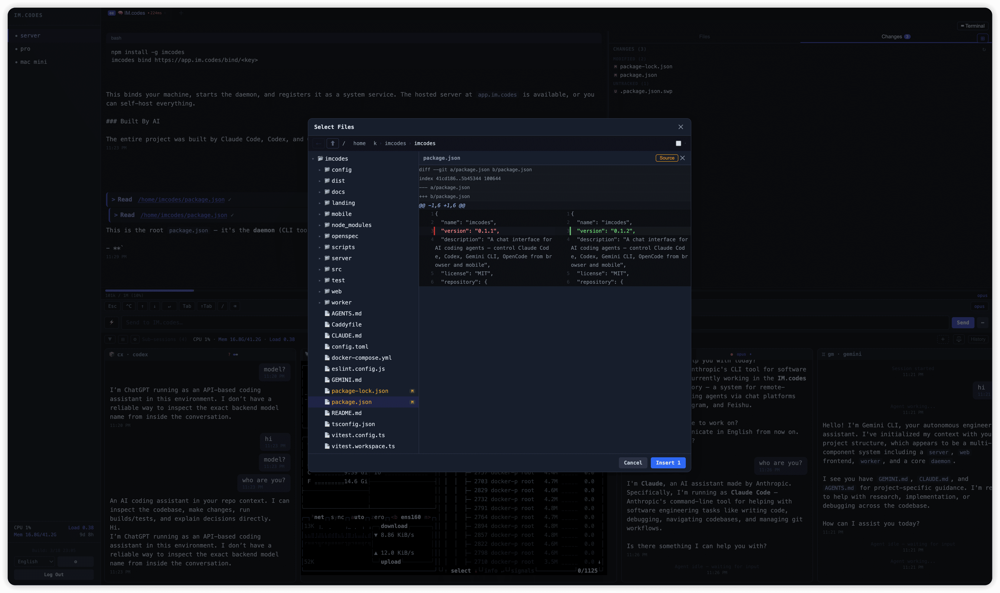

# IM.codes

A purpose-built interface for managing AI coding agents. Remote terminal, multi-agent orchestration, and session management — from any device.

## Screenshots

### Desktop

<p>
<a href="https://raw.githubusercontent.com/im4codes/imcodes/master/landing/imcodes0.png"></a>
<a href="https://raw.githubusercontent.com/im4codes/imcodes/master/landing/imcodes1.png"></a>
<a href="https://raw.githubusercontent.com/im4codes/imcodes/master/landing/imcodes2.png"></a>
<a href="https://raw.githubusercontent.com/im4codes/imcodes/master/landing/imcodes3.png"></a>
</p>

### Mobile

<p>
<a href="https://raw.githubusercontent.com/im4codes/imcodes/master/landing/imcodes-m1.png"></a>
<a href="https://raw.githubusercontent.com/im4codes/imcodes/master/landing/imcodes-m2.png"></a>
<a href="https://raw.githubusercontent.com/im4codes/imcodes/master/landing/imcodes-m3.png"></a>
<a href="https://raw.githubusercontent.com/im4codes/imcodes/master/landing/imcodes-m4.png"></a>
<a href="https://raw.githubusercontent.com/im4codes/imcodes/master/landing/imcodes-m0.png"></a>
</p>

## Why

AI coding agents live in terminals. Managing them means SSH sessions, split panes, copy-pasting between windows. It doesn't scale — not across machines, not from a phone, and definitely not when you're running multiple agents on a single task.

IM.codes gives you a single control plane: remote terminals that work like SSH without the SSH, a chat layer that understands agent output, and multi-agent workflows that let you pit different models against each other.

This is a personal project. I haven't written any code myself — it was built almost entirely by [Claude Code](https://github.com/anthropics/claude-code), with significant contributions from [Codex](https://github.com/openai/codex) and [Gemini CLI](https://github.com/google-gemini/gemini-cli).

## Features

### Remote Terminal

Full terminal access to your agent sessions from any browser — no SSH, no VPN, no port forwarding. Switch between raw terminal mode (the native CLI experience) and a structured chat view with parsed tool calls, thinking blocks, and streaming output. Real-time PTY streaming with zero message limits.

### Multi-Agent Discussions & Audit

Single-model output shouldn't be trusted blindly. Spawn quick discussion rounds where multiple agents — across different providers — review, audit, or brainstorm on the same topic. Each agent reads prior contributions and adds their own. Modes include `discuss`, `audit`, `review`, and `brainstorm`. Works across Claude Code, Codex, and Gemini CLI, including sandboxed agents.

### Multi-Server, Multi-Session Management

Connect multiple dev machines to one dashboard. Each machine runs a lightweight daemon that manages local agent sessions via tmux. See all servers and sessions at a glance — start, stop, restart, or switch between them instantly. Sub-sessions let you spawn additional agents from within a running session for parallel tasks.

### File Browser & Preview

Browse project files, preview any file with syntax highlighting, and view git diffs with inline change comparison — all from the browser. Upload files from browser or phone (including camera capture), referenced in chat with `@path`.

### Mobile & Notifications

Full mobile support with biometric auth. Push notifications when an agent finishes a task or needs attention — so you don't have to watch a spinner.

### OTA Updates

Daemon self-upgrades via npm. Trigger from the web UI for one device or all devices at once.

## Architecture

```
You (browser / mobile)
        ↓ WebSocket
Server (self-hosted)
        ↓ WebSocket
Daemon (your machine, manages tmux)
        ↓ tmux
AI Agents (Claude Code / Codex / Gemini CLI / OpenCode)
```

The daemon runs on your dev machine and manages agent sessions through tmux. The server relays connections between your devices and the daemon. Everything stays on your infrastructure.

## Install

```bash
npm install -g imcodes
```

## Quick Start

Use the hosted version at [app.im.codes](https://app.im.codes), or self-host the server on your own infrastructure.

```bash
imcodes bind https://app.im.codes/bind/<api-key>
```

This binds your machine, starts the daemon, and registers it as a system service.

## Self-Host

### One-Command Setup

Deploy server + daemon on a single machine. Requires Docker and a domain with DNS pointing to the server.

```bash
npm install -g imcodes
mkdir imcodes && cd imcodes
imcodes setup --domain imc.example.com
```

This generates all config, starts PostgreSQL + server + Caddy with automatic HTTPS, creates the admin account, and binds the local daemon — all in one step. Credentials are printed at the end.

To connect additional machines:

```bash
npm install -g imcodes
imcodes bind https://imc.example.com/bind/<api-key>
```

### Manual Setup

If you prefer to configure manually:

```bash
git clone https://github.com/im4codes/imcodes.git && cd imcodes
./gen-env.sh imc.example.com        # generates .env with random secrets, prints admin password
docker compose up -d
```

Login at `https://your-domain` with `admin` and the printed password. Bind your dev machine with `imcodes bind`.

## Requirements

- macOS or Linux (tested on both). Windows users need [WSL](https://learn.microsoft.com/en-us/windows/wsl/) — native Windows is not supported since the project uses tmux to manage agent sessions.
- Node.js >= 20
- tmux
- At least one AI coding agent: [Claude Code](https://github.com/anthropics/claude-code), [Codex](https://github.com/openai/codex), [Gemini CLI](https://github.com/google-gemini/gemini-cli), or [OpenCode](https://github.com/opencode-ai/opencode)

## License

[GPLv3](LICENSE)
