# [IM.codes](https://im.codes)

**The IM for agents.**

A specialized instant messenger for AI agents. Keep long-running coding-agent sessions within reach from mobile or web, with terminal access, file browsing, git views, localhost preview, notifications, and multi-agent workflows built in. Works with [Claude Code](https://github.com/anthropics/claude-code), [Codex](https://github.com/openai/codex), [Gemini CLI](https://github.com/google-gemini/gemini-cli), [OpenClaw](https://openclaw.com), [Qwen](https://github.com/QwenLM/qwen-agent), and more — including native streaming output for transport-backed agents.

> **Disclaimer:** This is an actively developed personal open-source project. There are no warranties, no SLA, and no guarantees of stability, security, or backward compatibility. Use at your own risk. Breaking changes may happen at any time without notice.

## Screenshots

### Desktop

<p>
<a href="https://raw.githubusercontent.com/im4codes/imcodes/master/landing/imcodes-sidebar.png">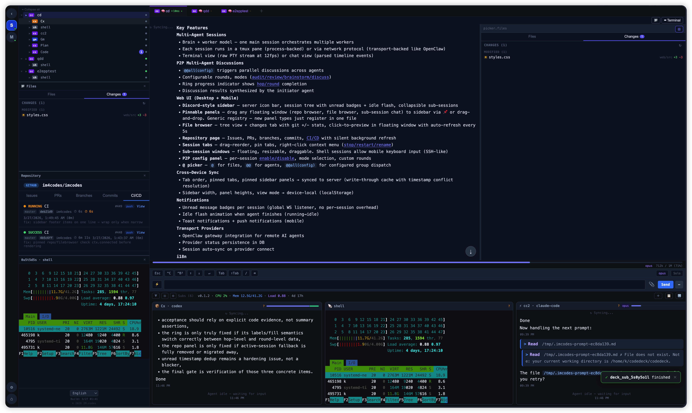</a>
<a href="https://raw.githubusercontent.com/im4codes/imcodes/master/landing/imcodes0.png">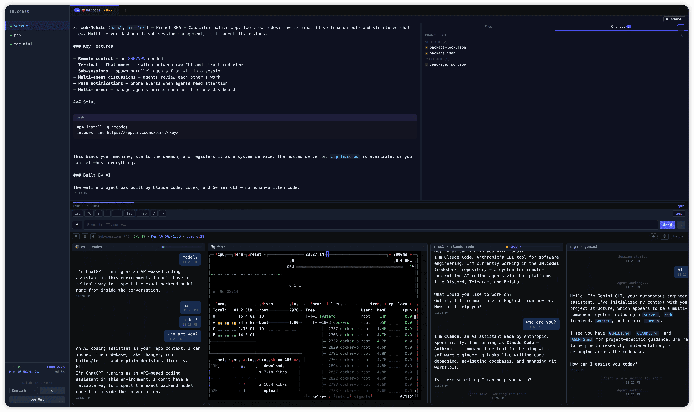</a>
<a href="https://raw.githubusercontent.com/im4codes/imcodes/master/landing/imcodes1.png">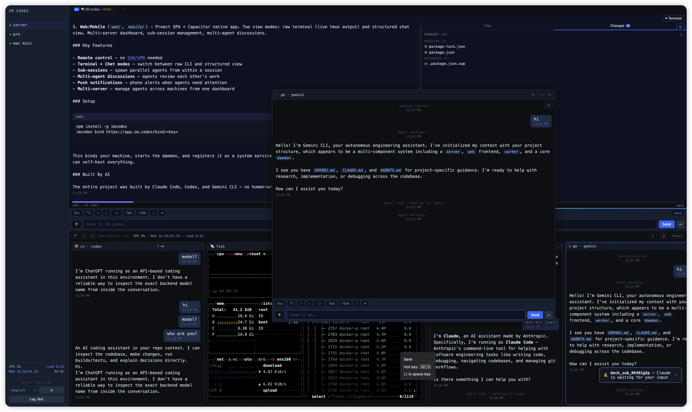</a>
<a href="https://raw.githubusercontent.com/im4codes/imcodes/master/landing/imcodes2.png">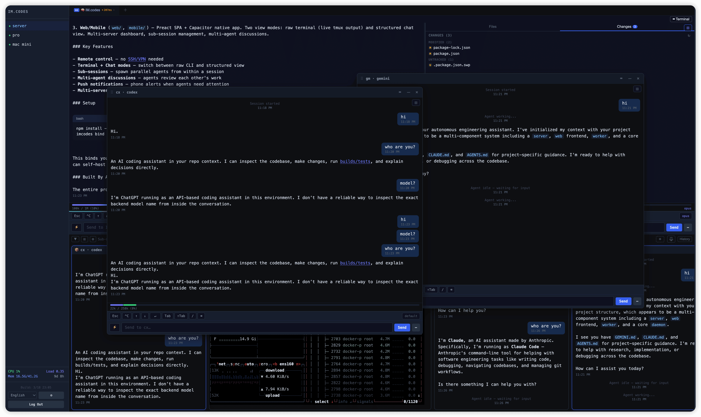</a>
</p>

### iPad / Tablet

<p>
<a href="https://raw.githubusercontent.com/im4codes/imcodes/master/landing/imcodes-ipad2.png">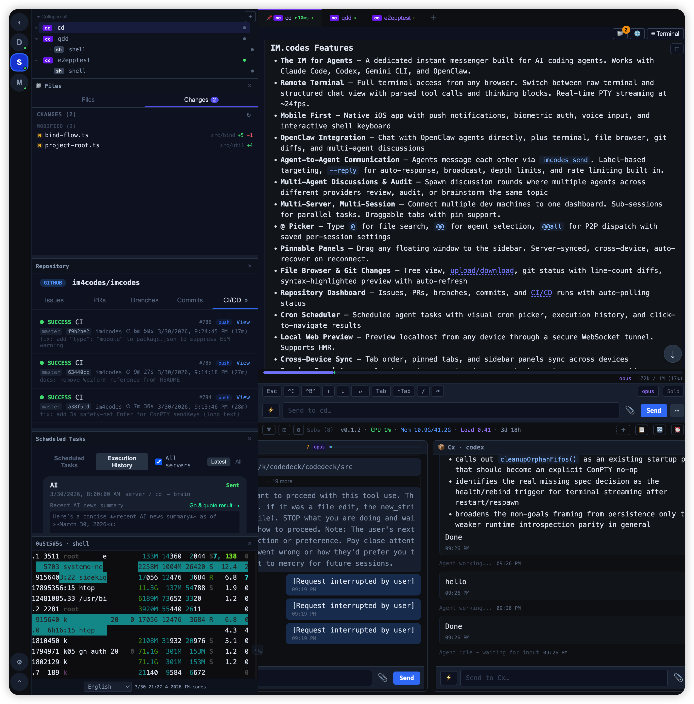</a>
<a href="https://raw.githubusercontent.com/im4codes/imcodes/master/landing/imcodes-ipad3.png">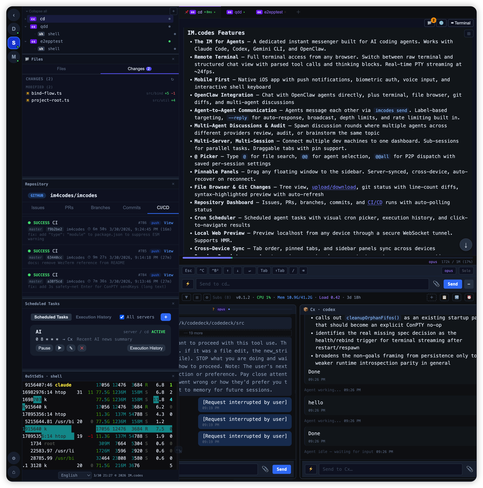</a>
</p>

### Mobile

<p>
<a href="https://raw.githubusercontent.com/im4codes/imcodes/master/landing/imcodes-m6.png">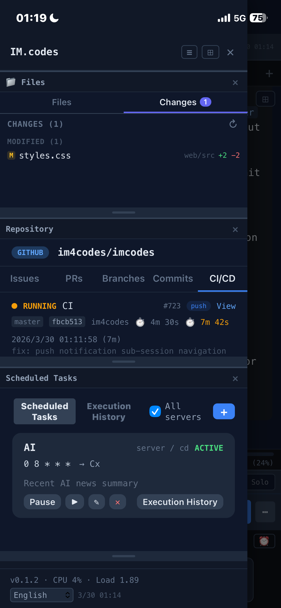</a>
<a href="https://raw.githubusercontent.com/im4codes/imcodes/master/landing/imcodes-m7.png">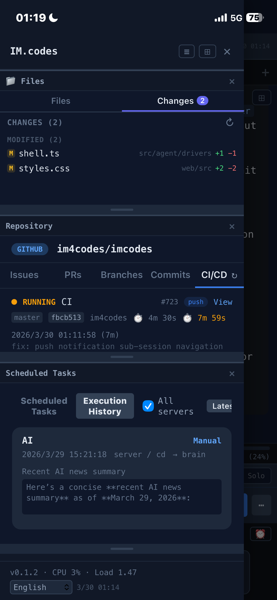</a>
<a href="https://raw.githubusercontent.com/im4codes/imcodes/master/landing/imcodes-m8.png">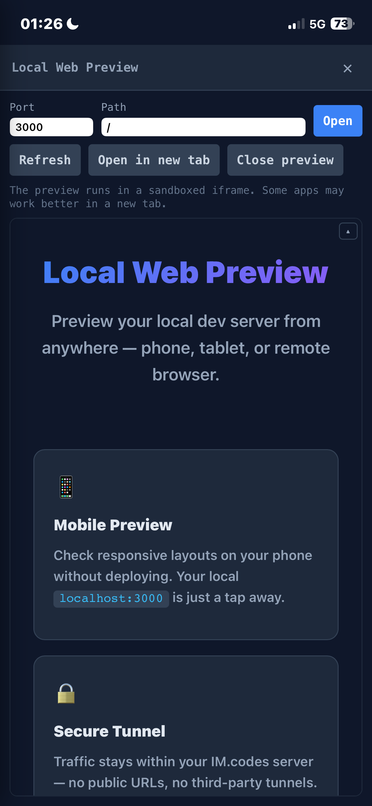</a>
<a href="https://raw.githubusercontent.com/im4codes/imcodes/master/landing/imcodes-m5.png">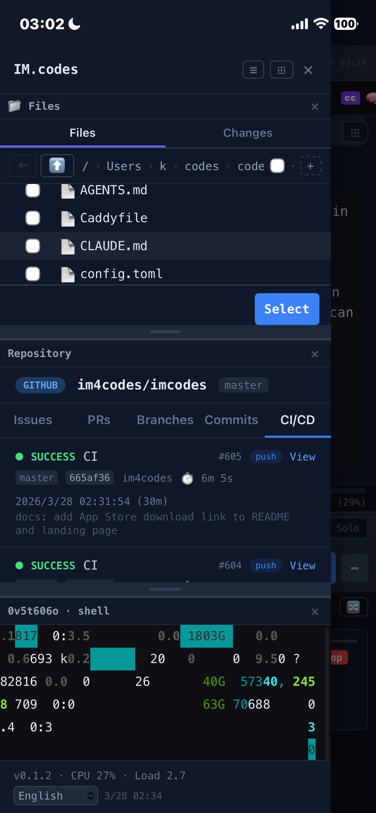</a>
<a href="https://raw.githubusercontent.com/im4codes/imcodes/master/landing/imcodes-m1.png">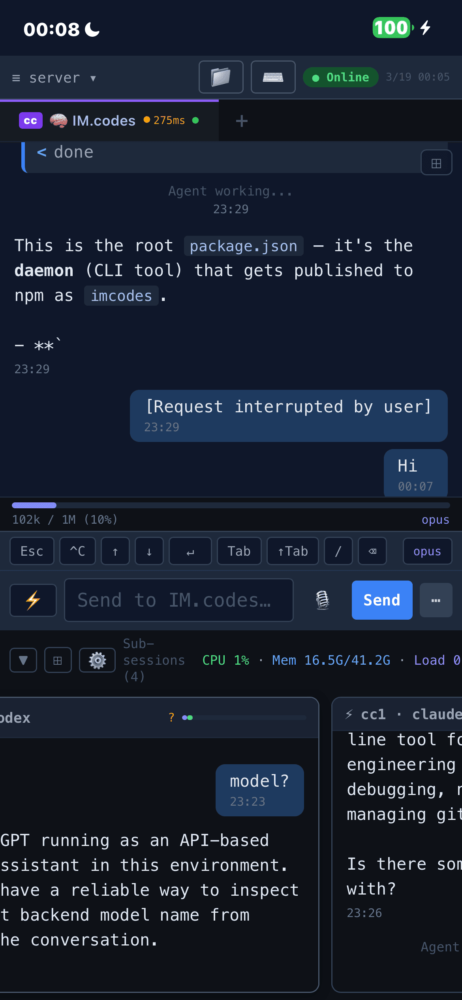</a>
<a href="https://raw.githubusercontent.com/im4codes/imcodes/master/landing/imcodes-m2.png">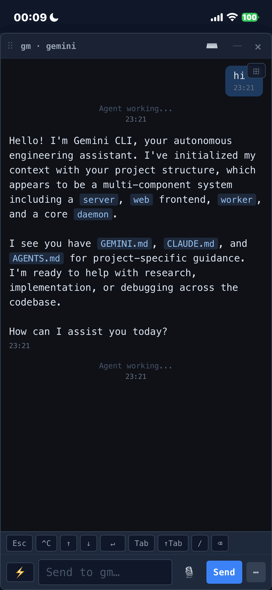</a>
<a href="https://raw.githubusercontent.com/im4codes/imcodes/master/landing/imcodes-m3.png">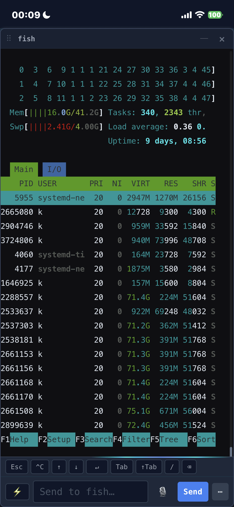</a>
<a href="https://raw.githubusercontent.com/im4codes/imcodes/master/landing/imcodes-m4.png">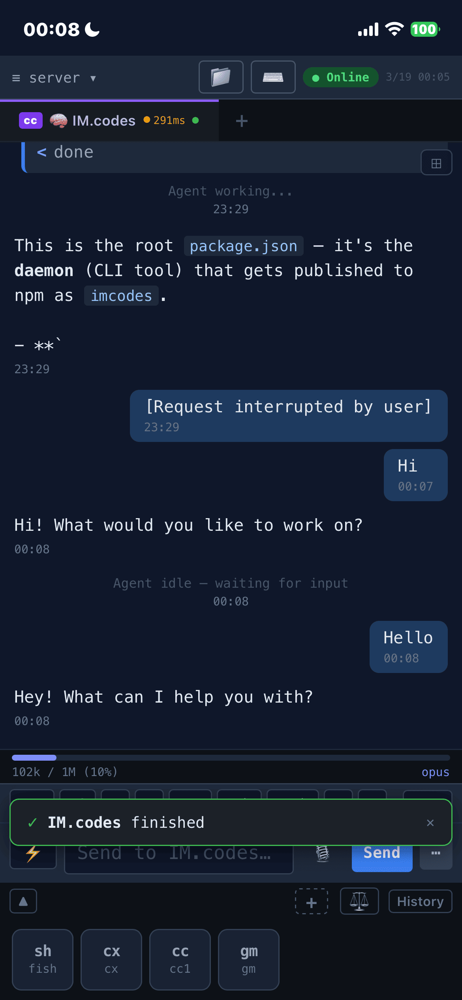</a>
<a href="https://raw.githubusercontent.com/im4codes/imcodes/master/landing/imcodes-m0.png">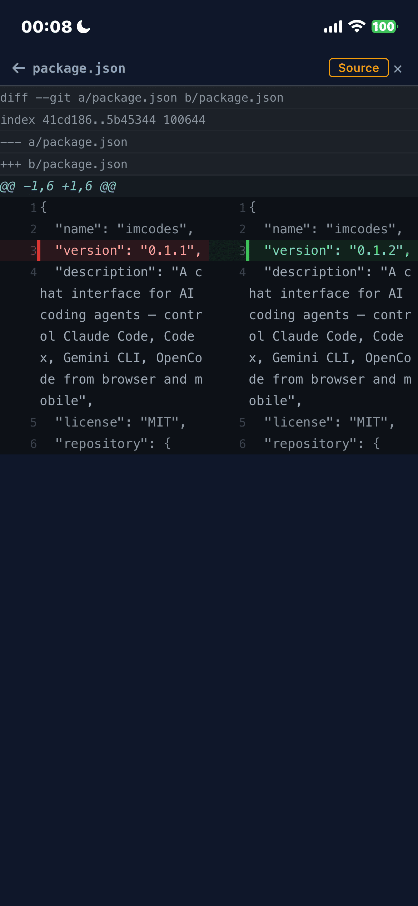</a>
</p>

## Download

<a href="https://apps.apple.com/us/app/im-codes/id6761014424"></a>

Also available as a [web app](https://app.im.codes) and via `npm install -g imcodes` (daemon CLI).

## Why

When you leave your desk, most coding-agent workflows fall apart. The agent is still running in a terminal, but continuing the work usually means SSH, tmux attach, remote desktop hacks, or waiting until you're back at your laptop.

[IM.codes](https://im.codes) keeps those sessions within reach from mobile or web: open the terminal, inspect files and git changes, preview localhost from another device, get notified when work finishes, and keep multiple agents moving on your own infrastructure.

It is not another AI IDE or a generic remote terminal. It is the messaging/control layer around terminal-based coding agents.

This is a personal project. I haven't written any code myself — it was built almost entirely by [Claude Code](https://github.com/anthropics/claude-code), with significant contributions from [Codex](https://github.com/openai/codex) and [Gemini CLI](https://github.com/google-gemini/gemini-cli).

## Features

### Remote Terminal

Full terminal access to your agent sessions from any browser — no SSH, no VPN, no port forwarding. Switch between raw terminal mode (the native CLI experience) and a structured chat view with parsed tool calls, thinking blocks, and streaming output. Real-time PTY streaming at 12fps with zero message limits.

### File Browser & Git Changes

Browse project files with a tree view. Upload files, images, and photos from any device — download files directly from the server. Changes tab shows git status with per-file `+additions`/`-deletions` line counts in color. Click a file to open a floating preview window with syntax highlighting, diff view, and auto-refresh every 5s. Pin the file browser to the sidebar — it follows the active tab's project directory automatically.

### Local Web Preview

Preview your local dev server from any device — phone, tablet, or remote browser — without deploying. The daemon proxies `localhost` traffic through a secure WebSocket tunnel to the server. HTML rewriting and a runtime patch handle URL remapping so links, fetch, and WebSocket connections just work. Supports HMR/hot-reload via WebSocket tunneling. No public URLs, no third-party tunnels — traffic stays within your IM.codes server.

### Mobile & Notifications

Full mobile support with biometric auth and push notifications. Shell sessions allow interactive keyboard input on mobile (SSH-like). Sub-session preview cards always show latest messages. Toast notifications navigate directly to the relevant session.

### Multi-Agent Discussions & Audit

Single-model output shouldn't be trusted blindly. Spawn quick discussion rounds where multiple agents — across different providers — review, audit, or brainstorm on the same topic. Each agent reads prior contributions and adds their own. Modes include `discuss`, `audit`, `review`, and `brainstorm`. Ring progress indicator shows round/hop completion in the sidebar. Works across Claude Code, Codex, and Gemini CLI, including sandboxed agents.

### Streaming Transport Agents

Native streaming output support for transport-backed agents like [OpenClaw](https://openclaw.com) and [Qwen](https://github.com/QwenLM/qwen-agent). These agents connect via network protocols (WebSocket or local SDK) instead of terminal scraping, delivering structured event streams with real-time delta updates, tool call tracking, and session restore.

### Agent-to-Agent Communication

Agents can message each other directly using `imcodes send`. An agent running in one session can ask a sibling to review code, run tests, or coordinate on a task — no user intervention needed. Target resolution by label, session name, or agent type. `--reply` flag instructs the target to send its response back automatically. Built-in circuit breakers prevent abuse (depth limit, rate limiting, broadcast cap).

```bash
imcodes send "Plan" "review the changes in src/api.ts"
imcodes send "Cx" "run tests" --reply
imcodes send --all "migration complete, check your end"
```

Beyond agent-to-agent chat, you can use `script` sessions to build custom automation. A Python script running in a script session can call `imcodes send` to trigger agents based on any external event:

```python
# monitor.py — watch a log file, trigger agent when errors appear
import subprocess, time

while True:
    with open("/var/log/app.log") as f:
        for line in f:
            if "ERROR" in line:
                subprocess.run([
                    "imcodes", "send", "Claude",
                    f"Fix this error and write the patch to /tmp/fix.patch:\n{line}"
                ])
    time.sleep(30)
```

```bash
# Webhook → agent: GitHub webhook handler triggers code review
curl -X POST https://your-server/webhook -d '{"pr": 42}' \
  && imcodes send "Gemini" "review PR #42, write summary to /tmp/review.md"

# CI → agent: post-build trigger
imcodes send "Claude" "tests failed on main, check CI log at /tmp/ci.log and fix" --reply
```

Use cases: log monitoring → auto-fix, webhook-triggered code review, CI failure auto-diagnosis, scheduled data pipeline checks, custom approval workflows with output written to specific files for human review.
### @ Picker — Smart Agent & File Selection

Type `@` to search project files, `@@` to select agents for P2P dispatch. `@@all(config)` sends to all configured agents with saved per-session P2P settings (mode, rounds, participants). Custom round counts via `@@all+`. The picker integrates with the structured WS routing — daemon handles all expansion, frontend stays clean.

### Multi-Server, Multi-Session Management

Connect multiple dev machines to one dashboard. Each machine runs a lightweight daemon that manages local agent sessions via tmux. See all servers and sessions at a glance — start, stop, restart, or switch between them instantly. Sub-sessions let you spawn additional agents from within a running session for parallel tasks. Draggable tabs with pin support and right-click context menus.

### Discord-Style Sidebar

Server icon bar for instant multi-server switching. Hierarchical session tree with collapsible sub-sessions, unread message badges, and idle flash animation when agents finish tasks. Pin any floating window (file browser, repository, sub-session chat) to the sidebar for persistent access. Language switcher and build info at the bottom.

### Pinnable Panels

Drag any floating window to the sidebar to pin it as a persistent panel. Supports file browser, repository page, sub-session chat, and terminal views. Panels are resizable, server-synced (cross-device), and auto-recover on reconnect. Generic registry — new panel types register in one file.

### Repository Dashboard

View issues, pull requests, branches, commits, and CI/CD runs directly in the app. Silent background refresh — no more pull-to-refresh jitter. CI status auto-polls (10s when running, 15s otherwise). Pin the repository page to the sidebar for always-on visibility.

### Scheduled Tasks (Cron)

Automate recurring agent workflows with cron-style scheduling. Create scheduled tasks that send commands to specific sessions or trigger multi-agent P2P discussions on a timetable. Visual cron picker for common intervals, timezone-aware scheduling, and manual "Run Now" for testing. Execution history with expandable result detail — click any record to navigate to the target session and quote the result for follow-up. Cross-job execution list with Latest/All modes and multi-server filtering.

### Cross-Device Sync

Tab order, pinned tabs, and pinned sidebar panels sync across devices via the server preferences API. Write-through cache pattern: localStorage for instant render, debounced server PUT for cross-device consistency. Timestamped payloads for conflict resolution. Device-specific state (sidebar width, panel heights, view mode) stays local.

### Internationalization

7 languages: English, 简体中文, 繁體中文, Español, Русский, 日本語, 한국어. Language switcher in the sidebar footer. All user-visible strings use i18n keys.

### OTA Updates

Daemon self-upgrades via npm. Trigger from the web UI for one device or all devices at once.

## What IM.codes is not

- Not another AI IDE
- Not just a chat wrapper
- Not just a remote terminal client
- Not a replacement for Claude Code, Codex, Gemini CLI, OpenClaw, or Qwen
- It is the messaging/control layer around them

## Architecture

```
You (browser / mobile)
        ↓ WebSocket
Server (self-hosted)
        ↓ WebSocket
Daemon (your machine)
        ↓ tmux / WezTerm / transport
AI Agents (Claude Code / Codex / Gemini CLI / OpenClaw)
        ↔ imcodes send (agent-to-agent)
```

The daemon runs on your dev machine and manages agent sessions through tmux or WezTerm (process-backed) or network protocols (transport-backed, e.g. OpenClaw gateway). Agents can communicate with each other via `imcodes send`. The server relays connections between your devices and the daemon. Everything stays on your infrastructure.

## Install

```bash
npm install -g imcodes
```

## Quick Start

> **Self-hosting is strongly recommended.** The shared instance at `app.im.codes` is for testing only — it comes with no uptime guarantees, may be rate-limited, and could be targeted. This is a personal project with no commercial support. For anything beyond evaluation, deploy the server on your own infrastructure.

Use [app.im.codes](https://app.im.codes) for evaluation, or self-host for anything real.

```bash
imcodes bind https://app.im.codes/bind/<api-key>
```

This binds your machine, starts the daemon, registers it as a system service, and brings the machine into the web/mobile dashboard.

## Self-Host

### One-Command Setup

Deploy server + daemon on a single machine. Requires Docker and a domain with DNS pointing to the server.

```bash
npm install -g imcodes
mkdir imcodes && cd imcodes
imcodes setup --domain imc.example.com
```

This generates all config, starts PostgreSQL + server + Caddy with automatic HTTPS, creates the admin account, and binds the local daemon — all in one step. Credentials are printed at the end.

To connect additional machines:

```bash
npm install -g imcodes
imcodes bind https://imc.example.com/bind/<api-key>
```

### Manual Setup

If you prefer to configure manually:

```bash
git clone https://github.com/im4codes/imcodes.git && cd imcodes
./gen-env.sh imc.example.com        # generates .env with random secrets, prints admin password
docker compose up -d
```

Login at `https://your-domain` with `admin` and the printed password. Bind your dev machine with `imcodes bind`.

## Requirements

- macOS or Linux (tested on both)
- **Windows (experimental)**: Native support via [ConPTY](https://devblogs.microsoft.com/commandline/windows-command-line-introducing-the-windows-pseudo-console-conpty/) (built-in on Windows 10+). Just `npm install -g imcodes` — no extra software needed. WSL also works.
- Node.js >= 20
- Terminal multiplexer: [tmux](https://github.com/tmux/tmux) (Linux/macOS). Windows uses ConPTY (auto-detected, built-in).
- At least one AI coding agent: [Claude Code](https://github.com/anthropics/claude-code), [Codex](https://github.com/openai/codex), [Gemini CLI](https://github.com/google-gemini/gemini-cli), [OpenClaw](https://openclaw.com), or [Qwen](https://github.com/QwenLM/qwen-agent)

## Disclaimer

IM.codes is an independent open-source project and is not affiliated with, endorsed by, or sponsored by Anthropic, OpenAI, Google, Alibaba, OpenClaw, or any other company whose products are mentioned. All product names, trademarks, and registered trademarks are the property of their respective owners.

## License

[MIT](LICENSE)

© 2026 [IM.codes](https://im.codes)
