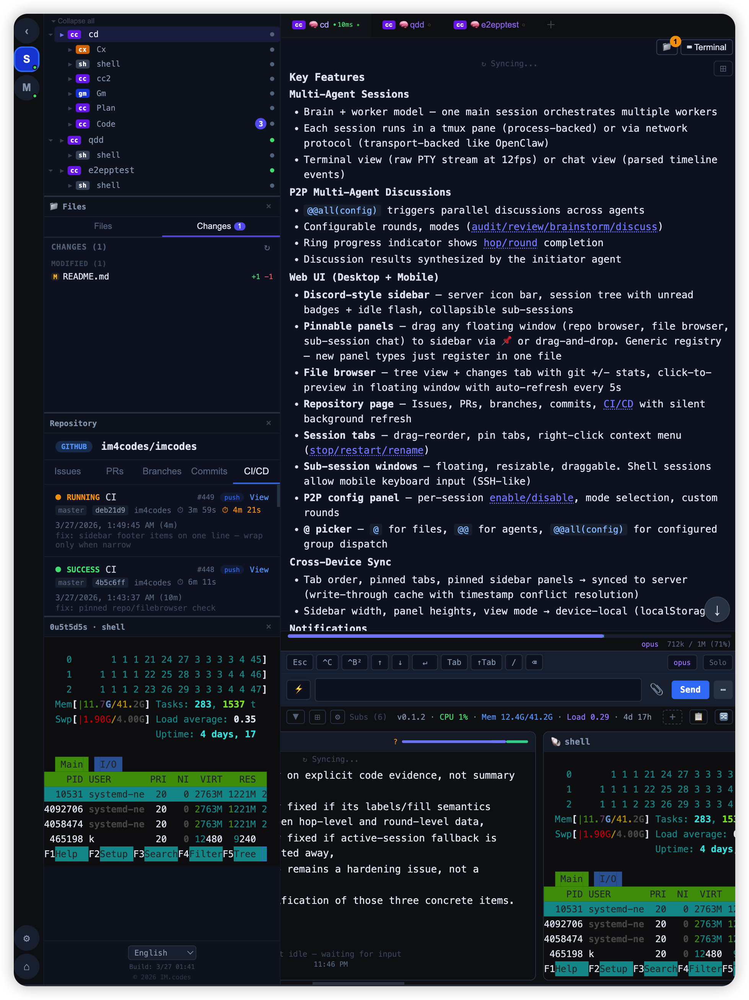

# [IM.codes](https://im.codes)

**The IM for agents.**

A specialized instant messenger for AI agents. More than chat — terminal access, file browsing, git diffs, voice input, and multi-agent orchestration built in. Works with [Claude Code](https://github.com/anthropics/claude-code), [Codex](https://github.com/openai/codex), [Gemini CLI](https://github.com/google-gemini/gemini-cli), [OpenClaw](https://openclaw.com), and more.

> **Disclaimer:** This is an actively developed personal open-source project. There are no warranties, no SLA, and no guarantees of stability, security, or backward compatibility. Use at your own risk. Breaking changes may happen at any time without notice.

## Screenshots

### Desktop

<p>
<a href="https://raw.githubusercontent.com/im4codes/imcodes/master/landing/imcodes-sidebar.png"></a>
<a href="https://raw.githubusercontent.com/im4codes/imcodes/master/landing/imcodes0.png"></a>
<a href="https://raw.githubusercontent.com/im4codes/imcodes/master/landing/imcodes1.png"></a>
<a href="https://raw.githubusercontent.com/im4codes/imcodes/master/landing/imcodes2.png"></a>
</p>

### iPad / Tablet

<p>
<a href="https://raw.githubusercontent.com/im4codes/imcodes/master/landing/imcodes-ipad.png"></a>
</p>

### Mobile

<p>
<a href="https://raw.githubusercontent.com/im4codes/imcodes/master/landing/imcodes-m1.png"></a>
<a href="https://raw.githubusercontent.com/im4codes/imcodes/master/landing/imcodes-m2.png"></a>
<a href="https://raw.githubusercontent.com/im4codes/imcodes/master/landing/imcodes-m3.png"></a>
<a href="https://raw.githubusercontent.com/im4codes/imcodes/master/landing/imcodes-m4.png"></a>
<a href="https://raw.githubusercontent.com/im4codes/imcodes/master/landing/imcodes-m0.png"></a>
</p>

## Why

Since 2026, developers talk to agents. Agents write code, run tools, and manage workflows. But generic chat apps were never built for this — and raw terminals don't scale across machines, devices, or multiple agents working in parallel.

[IM.codes](https://im.codes) is a dedicated messaging layer for AI agents: remote terminals that work like SSH without the SSH, a chat view that understands agent output, and multi-agent workflows that let you coordinate different models on the same task.

This is a personal project. I haven't written any code myself — it was built almost entirely by [Claude Code](https://github.com/anthropics/claude-code), with significant contributions from [Codex](https://github.com/openai/codex) and [Gemini CLI](https://github.com/google-gemini/gemini-cli).

## Features

### Remote Terminal

Full terminal access to your agent sessions from any browser — no SSH, no VPN, no port forwarding. Switch between raw terminal mode (the native CLI experience) and a structured chat view with parsed tool calls, thinking blocks, and streaming output. Real-time PTY streaming at 12fps with zero message limits.

### OpenClaw Integration

Chat with [OpenClaw](https://openclaw.com) agents directly in [IM.codes](https://im.codes) — plus terminal, file browser, git diffs, and multi-agent discussions that OpenClaw alone doesn't offer.

### Discord-Style Sidebar

Server icon bar for instant multi-server switching. Hierarchical session tree with collapsible sub-sessions, unread message badges, and idle flash animation when agents finish tasks. Pin any floating window (file browser, repository, sub-session chat) to the sidebar for persistent access. Language switcher and build info at the bottom.

### Multi-Agent Discussions & Audit

Single-model output shouldn't be trusted blindly. Spawn quick discussion rounds where multiple agents — across different providers — review, audit, or brainstorm on the same topic. Each agent reads prior contributions and adds their own. Modes include `discuss`, `audit`, `review`, and `brainstorm`. Ring progress indicator shows round/hop completion in the sidebar. Works across Claude Code, Codex, and Gemini CLI, including sandboxed agents.

### @ Picker — Smart Agent & File Selection

Type `@` to search project files, `@@` to select agents for P2P dispatch. `@@all(config)` sends to all configured agents with saved per-session P2P settings (mode, rounds, participants). Custom round counts via `@@all+`. The picker integrates with the structured WS routing — daemon handles all expansion, frontend stays clean.

### Multi-Server, Multi-Session Management

Connect multiple dev machines to one dashboard. Each machine runs a lightweight daemon that manages local agent sessions via tmux. See all servers and sessions at a glance — start, stop, restart, or switch between them instantly. Sub-sessions let you spawn additional agents from within a running session for parallel tasks. Draggable tabs with pin support and right-click context menus.

### Pinnable Panels

Drag any floating window to the sidebar to pin it as a persistent panel. Supports file browser, repository page, sub-session chat, and terminal views. Panels are resizable, server-synced (cross-device), and auto-recover on reconnect. Generic registry — new panel types register in one file.

### File Browser & Git Changes

Browse project files with a tree view. Upload files, images, and photos from any device — download files directly from the server. Changes tab shows git status with per-file `+additions`/`-deletions` line counts in color. Click a file to open a floating preview window with syntax highlighting, diff view, and auto-refresh every 5s. Pin the file browser to the sidebar — it follows the active tab's project directory automatically.

### Repository Dashboard

View issues, pull requests, branches, commits, and CI/CD runs directly in the app. Silent background refresh — no more pull-to-refresh jitter. CI status auto-polls (10s when running, 15s otherwise). Pin the repository page to the sidebar for always-on visibility.

### Cross-Device Sync

Tab order, pinned tabs, and pinned sidebar panels sync across devices via the server preferences API. Write-through cache pattern: localStorage for instant render, debounced server PUT for cross-device consistency. Timestamped payloads for conflict resolution. Device-specific state (sidebar width, panel heights, view mode) stays local.

### Mobile & Notifications

Full mobile support with biometric auth and push notifications. Shell sessions allow interactive keyboard input on mobile (SSH-like). Sub-session preview cards always show latest messages. Toast notifications navigate directly to the relevant session.

### Internationalization

7 languages: English, 简体中文, 繁體中文, Español, Русский, 日本語, 한국어. Language switcher in the sidebar footer. All user-visible strings use i18n keys.

### OTA Updates

Daemon self-upgrades via npm. Trigger from the web UI for one device or all devices at once.

## Architecture

```
You (browser / mobile)
        ↓ WebSocket
Server (self-hosted)
        ↓ WebSocket
Daemon (your machine, manages tmux)
        ↓ tmux / transport
AI Agents (Claude Code / Codex / Gemini CLI / OpenClaw)
```

The daemon runs on your dev machine and manages agent sessions through tmux (process-backed) or network protocols (transport-backed, e.g. OpenClaw gateway). The server relays connections between your devices and the daemon. Everything stays on your infrastructure.

## Install

```bash
npm install -g imcodes
```

## Quick Start

> **Self-hosting is strongly recommended.** The shared instance at `app.im.codes` is for testing only — it comes with no uptime guarantees, may be rate-limited, and could be targeted. This is a personal project with no commercial support. For anything beyond evaluation, deploy the server on your own infrastructure.

Use [app.im.codes](https://app.im.codes) to try it out, or self-host for production use.

```bash
imcodes bind https://app.im.codes/bind/<api-key>
```

This binds your machine, starts the daemon, and registers it as a system service.

## Self-Host

### One-Command Setup

Deploy server + daemon on a single machine. Requires Docker and a domain with DNS pointing to the server.

```bash
npm install -g imcodes
mkdir imcodes && cd imcodes
imcodes setup --domain imc.example.com
```

This generates all config, starts PostgreSQL + server + Caddy with automatic HTTPS, creates the admin account, and binds the local daemon — all in one step. Credentials are printed at the end.

To connect additional machines:

```bash
npm install -g imcodes
imcodes bind https://imc.example.com/bind/<api-key>
```

### Manual Setup

If you prefer to configure manually:

```bash
git clone https://github.com/im4codes/imcodes.git && cd imcodes
./gen-env.sh imc.example.com        # generates .env with random secrets, prints admin password
docker compose up -d
```

Login at `https://your-domain` with `admin` and the printed password. Bind your dev machine with `imcodes bind`.

## Requirements

- macOS or Linux (tested on both). Windows users need [WSL](https://learn.microsoft.com/en-us/windows/wsl/) — native Windows is not supported since the project uses tmux to manage agent sessions.
- Node.js >= 20
- tmux
- At least one AI coding agent: [Claude Code](https://github.com/anthropics/claude-code), [Codex](https://github.com/openai/codex), [Gemini CLI](https://github.com/google-gemini/gemini-cli), or [OpenClaw](https://openclaw.com)

## License

[MIT](LICENSE)

© 2026 [IM.codes](https://im.codes)
